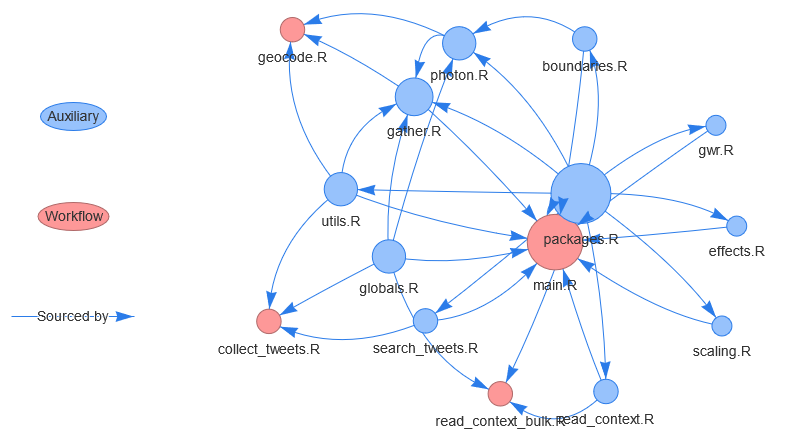

# Master's thesis

This repository holds the code associated to the Master's thesis called "Estimating contextual determinants of attitudes towards global environmental change: A semantic text modelling approach using georeferenced tweets". The goal of the thesis is to determine the (spatial) relationship between attitudes expressed in tweets and contextual variables. Tweet polarity is measured using Latent Semantic Scaling based on tweet texts. Tweet locations are estimated from tweet author profile information. The statistical association and its spatial variability is estimated using multilevel and geographically weighted regression.

## Context data

Tweet data is collected using the Twitter API. Context data is taken from OpenStreetMap the IÖR monitor and the INKAR database. Most data files are stripped from the repository due to copyright issues. Tweet data is dehydrated to only contain tweet IDs, polarity scores and locations.

## Structure

The code files are divided into workflow files and auxiliary files. Workflow files execute computations while functional files provide the functions, lists and packages for workflow files.

### Workflow files

-   [**main.R**](./R/main.R): Contains the main workflow to prepare, scale, model and plot the results
-   [**collect_tweets.R**](./R/collect_tweets.R): Collects tweets for the earliest possible day and saves them to ./data/tweets
-   [**geocode.R**](./R/geocode.R): Geocodes the earliest non-geocoded tweet package present in ./data/tweets and saves them to ./data/geo
-   [**read_context_bulk**](./R/read_context_bulk.R): Reads context variables from INKAR, IOER and OSM

### Auxiliary files

-   [**boundaries.R**](./R/boundaries.R): Functions to collect data on administrative boundaries
-   [**effects.R**](./R/effects.R): Utility functions for mixed effect models
-   [**gather.R**](./R/gather.R): Functions to read (and filter) tweet packages
-   [**globals.R**](./R/globals.R): Creates objects that are needed by multiple other code files
-   [**gwr.R**](./R/gwr.R): Utility functions for GWR
-   [**read_context**](./R/read_context.R): Functions that facilitate reading and cleaning context data
-   [**packages.R**](./R/packages.R): Loads all the packages needed for any of the code files (sourced in each file)
-   [**photon.R**](./R/photon.R): Functions to control and query photon and filter the results
-   [**scaling.R**](./R/scaling.R): Utility functions for document scaling
-   [**search_tweets.R**](./R/search_tweets.R): Functions to query the Twitter API
-   [**utils.R**](./R/utils.R): Various utility functions

